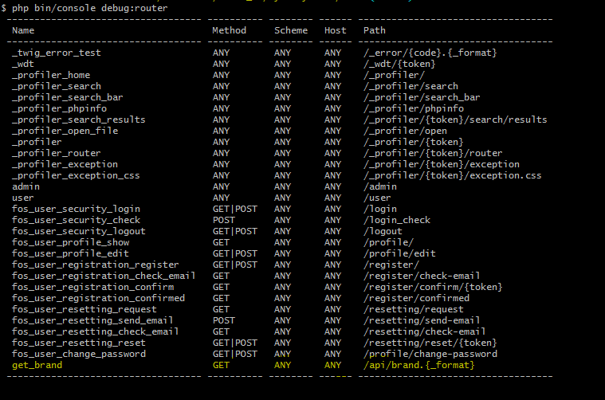

# Login & REST con FOSUserBundle y FOSRestBundle en Symfony 4.2.7

  

## Visión general
El objetivo con este proyecto es implementar las librerías [FOSUserBundle](https://github.com/FriendsOfSymfony/FOSUserBundle) y [FOSRestBundle](https://github.com/FriendsOfSymfony/FOSRestBundle) para crear un registro/login y una ruta que de como resultado un objeto JSON con los datos de una DB de "marcas y modelos" (si, de coches).
## Instalación 
```
$ git clone 
$ cd ./
$ composer install
$ composer require --dev server (opcional)
$ php bin/console server:start (o "symfony serve")
```
## Visión general del funcionamiento
El login que te da por defecto FOSUserBundle es este:


Si, se que por su apariencia solo lo puede querer su creador pero es 100% funcional y  [se puede modificar](https://github.com/FriendsOfSymfony/FOSUserBundle/issues/2783) 

El formulario de registro y si se preguntan porque se ven así los labels es por la "traducción" ([issues#1607](https://github.com/FriendsOfSymfony/FOSUserBundle/issues/1607) o [issue#2808](https://github.com/FriendsOfSymfony/FOSUserBundle/issues/2808)) y por cuestiones de tiempo lo dejé así


Si ingresamos con un usuario sin permisos de administrador podremos acceder a /user/


Pero si intentamos ingresar en /admin/


Ahora, si le damos privilegios de administrador a ese mismo usuario...


Ya puede ingresar


### Por último la API REST

Con respeto a la rest este ha sido mi progreso:

Tengo la ruta:


y el controlador


tests en progreso...

## Comentarios y consideraciones

FOSUserBundle es una librería que ofrece buenas funcionalidades al momento de crear y gestionar usuarios para las aplicaciones que así lo requieran pero para la versiones de Symfony más resientes (hasta la fecha 4.2 en este caso) recomiendo seguir esta  [guía de instalación](https://vfac.fr/blog/how-install-fosuserbundle-with-symfony-4) porque de momento existen ciertos [ problemas de compatibilidad](https://github.com/FriendsOfSymfony/FOSUserBundle/pull/2883) y  también porque  [no hay documentación oficial para esta versión ](https://github.com/FriendsOfSymfony/FOSUserBundle/issues/2861) (de momento)  y esta guía les puede ahorrar un montón de tiempo.
